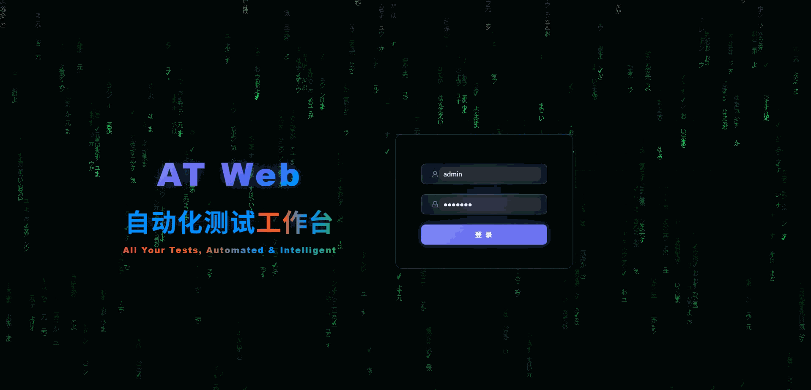
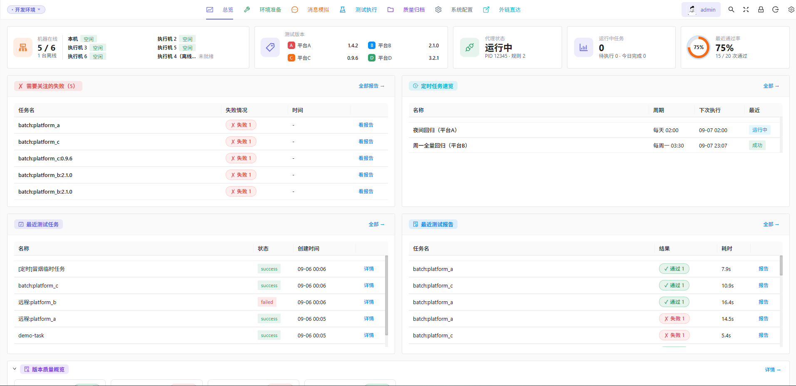

# AT Web · 通用自动化测试平台框架

一个**通用自动化测试平台框架**：完整的 Web 控制台（17 个页面 + 2 个外链）、REST API 契约与菜单结构，内置**可插拔的演示引擎（DemoEngine）+ 活数据**。开箱即可运行、可点、可展示，每个页面都有真实交互数据（进度、SSE 实时流、CRUD）。

> **定位**：这是一个"框架 + 演示"。执行能力（WS 消息代理 / 安装器 / Playwright / 分布式执行机）由引擎层接口抽象，可接入你自己的实现。

## 菜单结构与测试能力

顶部导航栏按**测试工作流**组织，一级菜单从左到右依次为：**总览 → 环境准备 → 消息模拟 → 测试执行 → 质量归档 → 系统配置 → 外链直达**。上下两级结构如下（一级菜单在上，其二级菜单列于下方，括号内为页面路径）：

```
总览                              /dashboard/index
环境准备（① 测试环境准备）        /prepare
├─ 安装与账号                      /prepare/env          测试版本安装、账号与 Agent 上线
├─ 代理与规则                      /prepare/proxy        代理状态与抓包规则
├─ 弱网工具                        /prepare/weaknet      弱网模拟（延迟/丢包/节流预设）
└─ 机器管理                        /prepare/machines     分布式执行机集群
消息模拟（② 消息链路）            /message
├─ 消息发送                        /message/send         模拟服务端下发消息
├─ 消息注入                        /message/inject       向在线客户端注入指令
├─ 消息嗅探                        /message/sniffer      消息流实时抓包
└─ Mock Server                     /message/mock-server  模板化模拟回复与消息流
测试执行（③ 执行与监控）          /test
├─ 测试参数                        /test/params          版本/店铺/Agent 等执行参数
├─ 执行用例                        /test/cases           用例选择与任务提交
├─ 任务记录                        /test/monitor         任务状态与实时日志
├─ 测试报告                        /test/report          结果详情与通过率统计
├─ 压力测试                        /test/ui-test         UI 并发压力场景
└─ 定时执行                        /test/schedule        定时/周期计划任务
质量归档（④ 版本质量）            /quality
├─ 版本测试记录                    /quality/versions     各平台版本测试结果归档
└─ 版本更新说明                    /quality/changelog    各平台版本 changelog 时间线
系统配置                          /config
└─ 配置管理                        /config/settings      配置文件树编辑（config/）
外链直达                          /external
├─ 缺陷跟踪平台                    /ext/defects          JIRA 风格缺陷跟踪演示页（静态）
└─ 文件存储                        /ext/files            对象存储风格文件管理演示页（静态）
```

平台覆盖的测试能力一览：

| 能力域 | 测试能力 |
|--------|----------|
| 环境准备 | 测试版本安装与升级（main / full 两种安装类型）、账号与 Agent 上线、代理规则管理、弱网模拟（基线 / 3G / 2G / 极差 / 断网 / 混沌等预设，支持延迟·丢包·节流·乱序·重复）、分布式执行机集群管理 |
| 消息链路 | 消息发送、消息注入、消息嗅探（双向消息流抓包）、Mock Server（模板化模拟回复、连接与消息流观察） |
| 测试执行 | 测试参数配置（版本 / 店铺 / Agent / 目标机器）、用例选择与批量提交、任务实时调度与日志（SSE 推流）、测试报告与通过率统计、UI 压力测试、定时执行计划 |
| 质量归档 | 版本测试记录（各平台版本 × 用例结果）、版本更新说明（按平台的时间线 changelog） |
| 系统与展示 | 总览大屏（机器在线 / 测试版本 / 代理 / 任务 / 通过率）、统一配置管理、环境切换（dev / prod）、外链直达（VM 控制台 / MinIO） |

> 所有能力默认由内置 `DemoEngine` + 演示数据驱动，页面可点可演示；接入真实引擎与真实数据后能力不变、仅数据来源切换。

## 截图





---

## 目录结构

```
at-web/
├── run_server.py            # 一键启动（Flask :6001，同时托管前端 dist）
├── pyproject.toml           # 后端依赖（Flask，极简）
├── config/                  # 配置树（全部为演示数据）
│   ├── main/config.yaml     #   统一配置（登录账号/端口/环境/路径）
│   ├── env.json             #   环境选择器（dev/prod 切换，页面左上角可改）
│   ├── accounts/accounts.yaml
│   ├── platforms/platforms.json
│   ├── agents/agents.json
│   ├── common.json
│   ├── mock_templates.json
│   └── phrases/shopping_faq.json
├── core/
│   ├── config.py            # 统一配置加载（YAML + env + JSON）
│   └── logging_config.py
├── server/
│   ├── __init__.py          # Flask 应用工厂（引擎初始化 + 种子 + 模块注册 + 前端托管）
│   ├── models.py            # TaskRecord 等共享模型
│   ├── live_log.py          # 任务级实时日志注册表
│   ├── runtime.py           # 后台线程安全运行时上下文（项目根/环境/平台）
│   ├── seed.py              # 首次启动填充演示数据
│   ├── engine/              # ★ 引擎抽象层（可插拔核心）
│   │   ├── base.py          #   Engine 接口（submit/run/cancel/logs/plan_steps/run_step）
│   │   ├── demo_engine.py   #   内置演示引擎（模拟 pending→running→success/failed + 报告）
│   │   └── registry.py      #   按配置选择引擎实现
│   └── modules/             # 14 个 REST 模块（Blueprint）
│       ├── auth/  cases/  config/  env/  health/  machines/
│       └── mock_ws/  plan/  proxy/  schedules/  tasks/  ui/  version_records/
├── frontend/                # Vben Admin 2 / Vue3 / Ant Design Vue
│   ├── src/api/platform/            # API 封装
│   ├── src/views/platform/          # 17 个业务页面
│   ├── src/router/routes/modules/   # platform.ts（业务菜单）+ external.ts（外链）
│   └── src/store/modules/tasks.ts   # 任务状态 store
├── scripts/
│   ├── smoke_test.py        # 96 项全端点冒烟测试
│   └── launch_detached.ps1  # 分离进程启动后端（调试用）
└── var/                     # 运行时生成（日志/JSON 数据/结果文件，不入库）
```

---

## 快速开始

### 1. 后端（Flask，Python ≥ 3.11）

```bash
cd at-web
uv venv .venv                      # 或 python -m venv .venv
uv sync                            # 或 pip install -e .
.venv/Scripts/python run_server.py # Windows；Linux/macOS 用 .venv/bin/python
```

- 后端监听 `http://127.0.0.1:6001`，**同时托管 `frontend/dist`**（生产等价路径，一条链路同时提供页面 + API + SSE）。
- 首次启动自动写入 `var/` 下的演示数据（任务历史、机器集群、用例目录、版本记录、定时任务、代理规则、Mock 模板等）。

### 2. 前端（Vben Admin 2，pnpm）

```bash
cd frontend
pnpm install
pnpm build          # 产出 dist/，由后端 :6001 直接托管
# 或开发模式（带热更新，/api 与 /ext 经 vite 代理转发到 :6001）：
pnpm dev
```

### 3. 登录

打开 `http://127.0.0.1:6001`，使用：

| 账号 | 密码 |
|------|-----------|
| `admin` | `demo123` |

> 登录账号可在 `config/main/config.yaml` 的 `web_users` 段修改。

### 4. 环境切换（dev / prod）

- 页面左上角环境徽章**点击即切换**（dev ↔ prod），服务端 `config/env.json` 的 `current` 同步写盘并全局生效；
- 也可以直接改 `config/env.json`（或 `config/main/config.yaml` 的 `current_env`）；
- 优先级：环境变量 `AT_WEB_ENV` > `config/env.json` > `config/main/config.yaml` > `dev`。

测试计划与账号配置按环境分组，切换后自动读写对应环境的数据。

### 5. 验证

```bash
# 后端全端点冒烟测试（96 项，覆盖 CRUD / 任务执行 / SSE / 定时 / 配置）
.venv/Scripts/python scripts/smoke_test.py
```

---

## 架构：三层解耦

```
┌────────────────────────────────────────────────────────────┐
│  Web 控制台 (frontend/)      17 页面 + 2 外链                │
│  Vue3 + Vben Admin + Ant Design Vue，走 /api 前缀            │
└───────────────────────────┬────────────────────────────────┘
                            │  REST (/api) + SSE (/api/ui/events)
┌───────────────────────────▼────────────────────────────────┐
│  REST API 层 (server/modules/)   14 个 Blueprint             │
│  实现"演示化"：CRUD 走 JSON 文件，执行走引擎                  │
└───────────────────────────┬────────────────────────────────┘
                            │  Engine 接口
┌───────────────────────────▼────────────────────────────────┐
│  执行引擎层 (server/engine/)   可插拔核心                     │
│  base.Engine (ABC) ── registry 按 config 选择实现            │
│  内置 DemoEngine：模拟进度 + 生成真实结构报告 + 落盘           │
└────────────────────────────────────────────────────────────┘
```

**关键点**：Web 层与 API 层不感知具体引擎；换真实引擎只需实现 `Engine` 接口并在 `config/main/config.yaml` 指定，无需改动任何页面或路由。

---

## 如何扩展（接入真实能力）

### 1. 接入真实执行引擎

`server/engine/base.py` 定义了接口（`submit / run / cancel / logs / plan_steps / run_step`）。以接入 Playwright 为例：

```python
# server/engine/playwright_engine.py
from .base import Engine

class PlaywrightEngine(Engine):
    def plan_steps(self, payload):   # 把任务拆成可执行步骤
        ...
    def run_step(self, step, ctx):   # 执行单步，返回 {"success":..,"detail":..}
        ...
```

然后在 `server/engine/registry.py` 注册、在 `config/main/config.yaml` 的 `engine` 段切换 `type`，页面与 API 零改动。

### 2. 新增一个平台（内置 4 个抽象平台 A/B/C/D）

- `config/platforms/platforms.json` 增加一条平台定义；
- `config/accounts/accounts.yaml` 增加该平台演示账号；
- `server/seed.py` 的 `_CASES` 增加该平台的用例目录（用于"测试执行"页浏览）；
- 前端各页面平台下拉由后端 `/api/plan/options` 等接口驱动，自动出现新平台。

### 3. 新增一个页面

- 在 `frontend/src/views/platform/<name>/index.vue` 建页面；
- 在 `frontend/src/router/routes/modules/platform.ts` 加路由（菜单按 meta 自动生成）；
- 后端按需加 `server/modules/<name>/__init__.py`（Blueprint 在 `server/__init__.py` 注册）。

### 4. 数据持久化

演示版**无数据库**，全部为 JSON/YAML 文件（`var/data/*.json`、`config/*.yaml`）。接真实场景时把 `server/modules/*/service.py` 中的文件读写替换为 ORM 即可，路由与前端不变。

---

## 演示数据说明

| 类别 | 演示数据 |
|------|----------|
| 执行引擎 | `DemoEngine` 模拟（可插拔替换） |
| 平台身份 | `platform_a/b/c/d`（平台 A/B/C/D） |
| 账号 | `13800000001~04` + `demo123456` |
| 店铺 | `演示店铺A/B/C` |
| 网段 | `10.0.0.11~16` / `10.0.0.100` |
| 被测程序 | `demo_agent.exe` @ `C:/demo-agent/...` |
| 外链 | 后端静态演示页 `/ext/defects`（缺陷跟踪）、`/ext/files`（文件存储），位于 `server/static/ext/` |

> 全部为虚构数据，`config/`、`server/`、`frontend/src/` 下无真实手机号 / 真实店铺名 / 内网 IP 残留。

---

## 验证记录

- `scripts/smoke_test.py`：**96 通过 / 0 失败**（14 模块全端点、任务提交→执行→报告、SSE、定时、配置、外链占位页）。
- 前端 `pnpm build`：**编译通过**（仅 chunk 体积告警）。
- 前后端联调：17 个页面数据端点全部 200 且有数据；提交任务可看到实时进度直至 `success` 并生成报告；`/api/ui/events` SSE 实时推流正常。

## 常见问题

- **端口被占用**：改 `config/main/config.yaml` 的 `server.port`，前端 vite `vite.config.ts` 代理 `target` 同步修改。
- **登录失败**：确认 `.env` 无覆盖、`config/main/config.yaml` 的 `web_users` 为 `admin/demo123`。
- **数据重置**：删除 `var/` 目录后重启，会重新生成演示数据。
- **`pnpm type:check` 报错**：Vben 脚手架严格 `vue-tsc` 对未用变量/部分类型敏感，属脚手架既有告警；项目实际交付以 `pnpm build`（vite 构建）为准，构建通过即编译正确。
